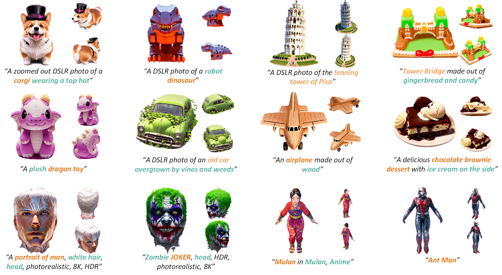

# Code for the paper "VividDreamer: Towards High-Fidelity and Efficient Text-to-3D Generation"

[Paper PDF (Arxiv)](https://arxiv.org/abs/2406.14964)
| [Project Page](https://narcissusex.github.io/VividDreamer/)

<video src="asserts/1.mp4" controls="controls" width="100%"></video>

<video src="asserts/2.mp4" controls="controls" width="100%"></video>

<video src="asserts/4.mp4" controls="controls" width="100%"></video>



Examples of text-to-3D content creations with the framework VividDreamer, within ~30mins on A100.

## Abtract
We propose Pose-dependent Consistency Distillation Sampling (PCDS), a novel yet efficient objective for diffusion-based 3D generation tasks. Specifically, PCDS builds the pose-dependent consistency function within diffusion trajectories, allowing to approximate true gradients through minimal sampling steps (1~3). <br>For efficient generation, we propose a coarse-to-fine optimization strategy, which first utilizes 1-step PCDS to create the basic structure of 3D objects, and then gradually increases PCDS steps to generate fine-grained details.

## Getting Start
### Cloning the Repository
The repository contains submodules, thus please check it out with 
```shell
# SSH
git clone git@github.com:EnVision-Research/LucidDreamer.git --recursive
```
or
```shell
# HTTPS
git clone https://github.com/EnVision-Research/LucidDreamer.git --recursive
```

### Setup
```shell
conda create -n VividDreamer python=3.9.16 --solver=classic
conda activate VividDreamer
conda install pytorch==2.1.2 torchvision==0.16.2 torchaudio==2.1.2 pytorch-cuda=12.1 -c pytorch -c nvidia
pip install -r requirements.txt
pip install submodules/diff-gaussian-rasterization/
pip install submodules/simple-knn/

git clone https://github.com/openai/shap-e.git
cd shap-e
pip install -e .
git clone https://github.com/openai/point-e.git
cd point-e
pip install -e .
```

Download [finetuned Shap-E](https://huggingface.co/datasets/tiange/Cap3D/tree/main/misc/our_finetuned_models) by Cap3D, and put it in `shap_e_model_cache`<br>
Download [finetuned Point-E](https://huggingface.co/datasets/tiange/Cap3D/tree/main/misc/our_finetuned_models) by Cap3D, and put it in `point_e_model_cache`

### Running
Text-to-3D Generation<br>
```shell
python train.py --opt './configs/text-to-3D.yaml' --test_ratio 5 --save_dir "output" --add_param "{'ModelParams.workspace':'Mandarin_Duck', 'GuidanceParams.text':'a DSLR photo of a mandarin duck swimming in a pond', 'GenerateCamParams.init_prompt': 'A mandarin duck'}"
```

## Acknowledgement

This work is built on many amazing research works and open-source projects:

- [gaussian-splatting](https://github.com/graphdeco-inria/gaussian-splatting) and [diff-gaussian-rasterization](https://github.com/graphdeco-inria/diff-gaussian-rasterization)
- [Latent Consistency Models](https://github.com/luosiallen/latent-consistency-model)
- [Point-E](https://github.com/openai/point-e)
- [Shap-E](https://github.com/openai/shap-e)

Thanks for their excellent work and great contribution to 3D generation area.